# DESIGN.md — The GDG Dino-Arcade & Recruitment Design System

> **Theme**: Neo-Arcade Precision & Google Developer Groups Industrialism  
> **Aesthetic Archetype**: 8-bit Chrome Dino Nostalgia meets Modern Linear/Vercel Engineering  
> **Single Source of Truth**: Layouts, Typography, Color Calibration, Motion Physics, and Component Specifications

---

## 1. Visual Theme & Atmosphere

### The Concept: "Pixel Industrialism & Neo-Arcade Precision"
The interface evokes the familiar, tactile joy of the offline **Chrome T-Rex Dino Game**, re-imagined as an ultra-high-end developer platform. Rather than looking like a cheap novelty gimmick, it fuses authentic 8-bit pixel geometry, stepped shadows, and CRT scanline textures with precision typography, clean macro-whitespace, and buttery 60fps spring physics.

- **Visual Density**: `Daily App Balanced` (Level 5/10). Generous padding for candidate reading comfort, tightening to dense HUD metrics in arcade and admin views.
- **Variance**: `Offset Asymmetric` (Level 8/10). Splits the department taxonomy into twin organic trees and uses staggered bento-style game stations rather than symmetrical rows.
- **Motion Intensity**: `Cinematic Spring Choreography` (Level 7/10). Stepped 2-frame retro sprite animations contrast dynamically with smooth, fluid cubic-bezier UI transitions and scroll-driven SVG circuit lines.

---

## 2. Color Palette & Semantic Roles

Every color has an exact semantic purpose. The palette unites the iconic **Google Developer Groups quadrant** (Blue, Red, Yellow, Green) with monochrome **Chrome Dino Desert** tones and high-contrast **Arcade Phosphor** highlights.

### A. The Chrome Dino Desert Monochromes (Base Canvas)
| Token Name | Hex Code | Purpose & Function |
| :--- | :--- | :--- |
| **OLED Arcade Black** | `#121316` | Dark mode primary background; deep monitor chassis |
| **Pixel Ground Dark** | `#1C1D21` | Dark mode surface card container and canvas ground fill |
| **Desert Sand Light** | `#F7F7F8` | Light mode primary canvas; crisp paper desert |
| **Dino Gray High** | `#535353` | Classic Chrome T-Rex sprite & obstacle color (Light Mode) |
| **Dino Gray Low** | `#ACACAC` | Classic Chrome T-Rex sprite & obstacle color (Dark Mode) |
| **Gravel Border** | `#2E3036` | 1px hairline card borders and structural dividers |
| **Phosphor White** | `#FFFFFF` | Primary high-contrast typography, icons, and focus outlines |
| **Muted Fog** | `#8A8F98` | Secondary copy, timestamps, metadata, and helper text |

### B. GDG Quadrant Accents (Track Identity & Station Lighting)
| Token Name | Hex Code | Purpose & Function |
| :--- | :--- | :--- |
| **GDG Blue (Cyanic Core)** | `#4285F4` | Technical tracks root, primary CTA buttons, active focus rings |
| **GDG Red (Crimson Signal)** | `#EA4335` | Competitive tracks, deadline urgency, destructive actions, rejects |
| **GDG Yellow (Amber Glow)** | `#FBBC04` | Operations & management tracks, trophy badges, warning notices |
| **GDG Green (Emerald Leaf)** | `#0F9D58` | Creative & UI tracks, accepted states, success checkmarks |

### C. Arcade Phosphor Accents (HUD & Gaming Station)
| Token Name | Hex Code | Purpose & Function |
| :--- | :--- | :--- |
| **Terminal Emerald** | `#10B981` | Dino high-score meter, live status pulses, game running state |
| **Amber CRT** | `#F59E0B` | Milestone alerts (100pt, 500pt), retro level badges |
| **Cyber Cyan** | `#06B6D4` | Animated scroll SVG branch paths, network connectors |

### Anti-Pattern Ban on Colors:
- ❌ **No AI-Purple/Violet Slop**: Pure `#7C3AED` or generic purple glows are strictly banned.
- ❌ **No Pure Pitch Black**: Never use `#000000` for content backgrounds; always use OLED Arcade Black (`#121316`) or `#1C1D21`.
- ❌ **No Blurry Colored Neon Glows**: Glows must be crisp, high-contrast, or subtle ambient drops, never muddy oversaturated halos.

---

## 3. Typographic Architecture

The typography operates on a deliberate dual-system: a **hyper-crisp modern sans** for deep reading and form inputs, contrasted against an **authentic pixel typeface** for arcade scores, HUD badges, and retro accents.

### A. Font Families
1. **Primary Interface Font**: `Inter` / `Geist Sans` (`--font-sans`)
   - Used for: Essay responses, form labels, administrative tables, candidate bios.
   - Scale: Clean tracking (`tracking-tight`), relaxed leading (`leading-relaxed`), max line length `65ch`.
2. **Pixel Arcade Font**: `Press Start 2P` (`--font-pixel`)
   - Used for: Game scores (`HI 00000 00124`), round badge stamps (`[R1: PASSED]`), arcade station headers, retro buttons.
   - Scale: Monospaced 8-bit glyphs, strictly uppercase, tight line-height (`leading-none` or `leading-normal`).
3. **Developer Monospace**: `Geist Mono` / `SF Mono` (`--font-mono`)
   - Used for: Registration numbers, applicant IDs, timestamps, Git commit hashes, code snippets.

### B. Type Scale & Hierarchy
| Level | Font Family | Size | Weight / Leading | Usage |
| :--- | :--- | :--- | :--- | :--- |
| **Arcade Hero H1** | Sans + Pixel Badge | `clamp(2.5rem, 6vw, 4.5rem)` | Extrabold (900), `-0.03em` tracking | Hero headline on landing page |
| **Track Tree H2** | Sans Display | `clamp(1.75rem, 3.5vw, 2.5rem)` | Bold (800), `-0.02em` tracking | Technical & Non-Technical tree titles |
| **Pixel Station Tag** | Pixel (`Press Start 2P`) | `0.75rem (12px)` | Regular (400), `tracking-wider` | Department card eyebrow tags & game HUD |
| **Body Standard** | Sans (`Inter`) | `1rem (16px)` | Regular (400), `1.6` line-height | Descriptions, candidate answers, review notes |
| **Metadata Mono** | Monospace | `0.8125rem (13px)` | Medium (500), `tabular-nums` | Submission dates, scores, candidate emails |

---

## 4. Component Design: The Double-Bezel & Pixel Geometry

All components adhere to the **Doppelrand (Double-Bezel)** architectural framework with stepped pixel edges:

```
┌──────────────────────────────────────────────────────────┐  <-- Outer Shell (Hairline ring, subtle bg)
│  ┌────────────────────────────────────────────────────┐  │
│  │                                                    │  │  <-- Inner Core (High contrast, inset shadow)
│  │    [PIXEL BADGE]                                   │  │
│  │    Station Title & Content                         │  │
│  │                                                    │  │
│  └────────────────────────────────────────────────────┘  │
└──────────────────────────────────────────────────────────┘  <-- Stepped Pixel Drop Shadow
```

### A. The Pixel Button (`components/design-system/PixelButton.jsx`)
- **Geometry**: Stepped rectangular borders with 2px crisp corners (`rounded-none` or `rounded-sm`).
- **Tactile Shadows**:
  - Idle: `box-shadow: 3px 3px 0px 0px currentColor` (or `#1C1D21`).
  - Active: `transform: translate(2px, 2px); box-shadow: 1px 1px 0px 0px currentColor;` to simulate an authentic mechanical arcade switch.
- **Button-in-Button Icon Architecture**:
  - Trailing arrows or icons are nested inside their own micro-circle or pixel square: `w-6 h-6 bg-black/10 dark:bg-white/15 flex items-center justify-center mr-[-4px]`.
- **Audio Feedback**: Optional discrete Web Audio click beep on press.

### B. The Double-Bezel Pixel Card (`components/design-system/PixelCard.jsx`)
- **Outer Shell**: `p-1.5 bg-muted/40 border border-border/80 rounded-xl shadow-pixel-sm`.
- **Inner Core**: `p-6 bg-card rounded-[calc(0.75rem-1.5px)] border border-border/40 shadow-[inset_0_1px_1px_rgba(255,255,255,0.08)]`.
- **Variant Modifiers**:
  - `technical`: Accent border tip in `#4285F4`.
  - `creative`: Accent border tip in `#0F9D58`.
  - `arcade`: Dark CRT scanline background with glowing green phosphor metrics.

### C. The Retro Badge (`components/design-system/PixelBadge.jsx`)
- Pill or stepped rectangular tag with 8-bit typography.
- Example: `[ 🌵 ROUND 1: SHORTLISTED ]` or `[ ⚡ HIGH SCORE: 1240 ]`.
- Pulsing phosphor dot: 6px animated breathing emerald or amber LED.

### D. The Arcade HUD Header (`components/design-system/ArcadeHUD.jsx`)
- Displays:
  - High score record: `HI 00000 00124`
  - Current session status: `STAGE 01 // DEPT APPLICATION`
  - Audio mute/unmute toggle (synthesized 8-bit sound effects)
  - Speed / Difficulty gauge indicator.

---

## 5. Layout Architecture & Dual-Tree Topology

### A. Landing Page Hero Layout
- **Asymmetric Split**:
  - **Left (55% desktop)**: Massive headline with embedded retro badges, value proposition, and primary CTAs ("Play Dino Runner", "Explore Department Trees").
  - **Right (45% desktop)**: Live, interactive **Dino Game Arcade Canvas**. The candidate can click into the canvas or press `Space` to run, jump over cacti, and bank high scores immediately.
- **Mobile Collapse**: Below `768px`, stacks vertically with the Arcade Canvas auto-sizing to full-width (`w-full aspect-[16/9]`) with touch jump/duck controls.

### B. Dual-Tree Department Explorer Layout (`/departments`)
The 12 departments are split into two parallel organic trees:
```
               [ RECRUITMENT PORTAL CANOPY ]
                            │
               ┌────────────┴────────────┐
               ▼                         ▼
     [ TECHNICAL TREE ]        [ NON-TECHNICAL TREE ]
               │                         │
     ├── Web Dev               ├── Design
     ├── App Dev               ├── UI/UX
     ├── Data Science & AI     ├── Management
     ├── Cloud & DevOps        ├── Publicity
     ├── Blockchain            └── Outreach
     ├── Game Dev
     └── Comp Programming
```
- **The Animated Scroll SVG Path**:
  - A persistent SVG layer spans the center between or behind the two trees.
  - As the candidate scrolls, the SVG stroke draws downward dynamically (`stroke-dasharray` & `stroke-dashoffset` hooked to scroll progress).
  - Branch nodes shoot outward from the main trunk and terminate at each department card.
  - When a department node enters the viewport threshold, its branch connector illuminates with that department's signature color.

### C. Candidate Profile & 3-Round Status Layout (`/profile`)
- **Top Bar**: Candidate Identity + Arcade Trophy Cabinet (All-time high score, rank badge, total runs).
- **Application Cards (Max 2)**:
  - Each application renders a 3-Stage Progress Stepper:
    1. **Round 1 (Application)**: Submitted answers preview, review status badge.
    2. **Round 2 (Task / Coding)**: Department problem statement, countdown timer, in-browser URL submission field.
    3. **Round 3 (Interview)**: Scheduled date/time, Google Meet button, panel instructions.

### D. Department-Scoped Admin Portal Layout (`/admin`)
- **Super Admin Mode**:
  - Global department filter (`All 12 Departments`).
  - Access to **Role & Privilege Manager**: Search users, promote to `dept_manager` or `super_admin`, assign departments.
- **Department Manager Mode**:
  - Department filter is locked and restricted to only assigned department(s).
  - Other departments' applicant records are filtered out at both API and UI layers.
  - Candidate Drawer with one-click round progression and curated email trigger.

---

## 6. Motion Philosophy & Spring Physics

- **No Linear Transitions**: All UI transitions use calibrated cubic-beziers:
  - Spring pop: `cubic-bezier(0.34, 1.56, 0.64, 1)`
  - Smooth deceleration: `cubic-bezier(0.16, 1, 0.3, 1)`
- **Sprite Animation**:
  - The Dino runner canvas runs at a solid 60 FPS requestAnimationFrame loop with pixel-perfect stepping.
- **Hardware Acceleration**:
  - All DOM animations animate exclusively `transform` and `opacity`.
  - Zero layout-triggering mutations on scroll.
- **Reduced Motion Support**:
  - Full compliance with `@media (prefers-reduced-motion: reduce)`.
  - Disables canvas auto-run, parallax drift, and scroll triggers for users with motion sensitivity.

---

## 7. Explicit Anti-Patterns (Banned AI Clichés)

1. ❌ **No standard thick Lucide icons**: Use only refined, ultra-clean 1.5px lines or authentic custom 8-bit glyphs.
2. ❌ **No AI purple-blue gradients**: No purple button shines, no neon backdrops.
3. ❌ **No centered generic hero**: Avoid boring centered text blocks; maintain dynamic asymmetric split.
4. ❌ **No generic circular loaders**: Always use themed skeletal pixel shimmers or miniature walking dino loaders.
5. ❌ **No duplicate CTA intent**: One primary action per section ("Play Dino Run" or "Apply to Department").
6. ❌ **No unstyled alerts**: Never show raw browser alerts or un-themed dialogs.

---

## 8. Implementation Phases

```mermaid
gantt
    title Recruitment Portal Implementation Phases
    dateFormat  X
    axisFormat %s
    section Phase 1
    Design System & Primitives Foundation : 0, 1
    section Phase 2
    Playable Dino Game & Landing Page     : 1, 2
    section Phase 3
    Dual-Tree Explorer & Scroll SVG Path  : 2, 3
    section Phase 4
    Dino Themed Auth Experience           : 3, 4
    section Phase 5
    Profile & 3-Round Status Tracker      : 4, 5
    section Phase 6
    Scoped Admin & Curated Round Emails   : 5, 6
    section Phase 7
    End-to-End Validation & CI/CD         : 6, 7
```



### Phase 1: Design System & Shared Primitives Foundation
- [ ] Configure `app/globals.css` with pixel box shadows, CRT scanlines, and ground patterns.
- [ ] Implement `components/design-system/PixelBadge.jsx`.
- [ ] Implement `components/design-system/PixelCard.jsx` (Doppelrand double-bezel).
- [ ] Implement `components/design-system/PixelButton.jsx` (Tactile 8-bit press physics).
- [ ] Implement `components/design-system/ArcadeHUD.jsx` (Score counters & audio toggles).
- [ ] Implement `components/design-system/PixelConnector.jsx` (SVG circuit pulse segments).

### Phase 2: Playable Chrome Dino Game & Landing Page Overhaul
- [ ] Build high-performance canvas runner `components/DinoGame.jsx` (Sprites, physics, collision detection, Web Audio 8-bit SFX, day/night cycles).
- [ ] Overhaul `components/Hero.jsx` with arcade split layout and direct playable station.
- [ ] Add Dino high score local storage caching and backend synchronization.

### Phase 3: Dual-Tree Department Explorer with Scroll SVG Path
- [ ] Build `components/DepartmentTrees.jsx` separating 7 Technical tracks from 5 Non-Technical tracks.
- [ ] Create responsive SVG scroll vine/trunk that draws and illuminates on scroll.
- [ ] Connect department cards to branch tips with Google accent highlights.
- [ ] Integrate into `app/(pages)/departments/page.jsx`.

### Phase 4: Dino-Themed Authentication Experience
- [ ] Re-skin `app/auth/signin/page.jsx` with pixel terminal borders and CRT scanline overlay.
- [ ] Add interactive animated Dino mascot that reacts to typing and submission.
- [ ] Verify institutional domain validation and OAuth workflows.

### Phase 5: Candidate Profile & 3-Round Recruitment Tracker
- [ ] Build `app/(pages)/profile/page.jsx` with Dino high scores, rank badges, and application status cards.
- [ ] Implement visual 3-Stage Progress Stepper (Round 1: Review -> Round 2: Task -> Round 3: Interview).
- [ ] Add Round 2 Task submission drawer (GitHub/Figma/Drive link).
- [ ] Build backend endpoints: `/api/user/profile`, `/api/user/dino-score`, `/api/user/submit-task`.

### Phase 6: Department-Scoped Admin Portal & Curated Round Emails
- [ ] Update `lib/security.ts` with role hierarchy: `super_admin`, `dept_manager`, `user`.
- [ ] Build `components/AdminRoleManager.jsx` (Super Admin privilege management).
- [ ] Update `components/AdminContent.jsx` and `components/DataTable.jsx` to enforce strict department scoping for managers.
- [ ] Implement Candidate Progression Drawer (advance to Round 2, Round 3, Accepted, Rejected).
- [ ] Build automated curated email dispatcher `/api/admin/advance-candidate` with personalized round details.

### Phase 7: End-to-End Validation & CI/CD Pipeline
- [ ] Run full automated test suite (`npm test`) covering BCNF, security, rate limiting, and new APIs.
- [ ] Verify ESLint cleanliness (`npm run lint`).
- [ ] Verify production build (`npm run build`).
